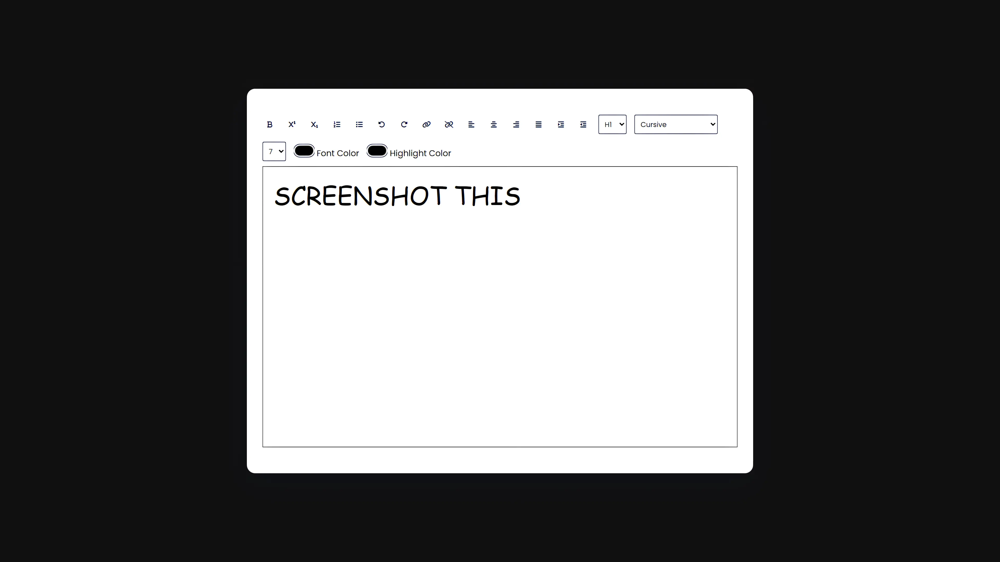
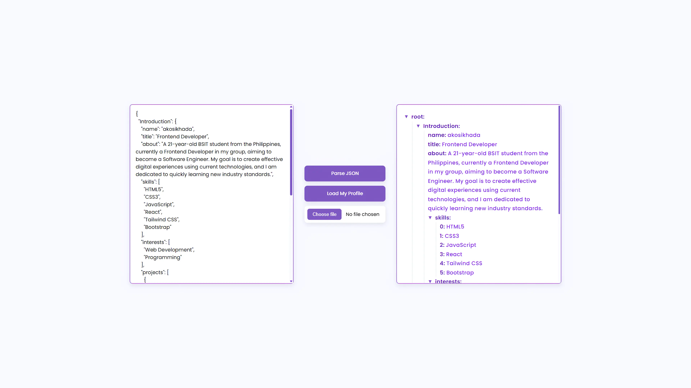

# 100 Days of JavaScript

<div align="center">
   
   
   
   
   
</div>

## 📝 Overview

The 100 Days of JavaScript challenge is a curated collection of projects created to strengthen and broaden web development skills. This repository gathers a diverse range of projects, covering various topics—from basic JavaScript fundamentals to advanced UI components and API integrations.

Each project is self-contained with its own documentation, making it easy to understand the implementation, run the code locally, and extend functionality for your own needs. Whether you're looking to practice specific JavaScript concepts or build a comprehensive portfolio of front-end projects, this collection provides practical, hands-on experience with modern web development techniques.

## 🔑 Key Features

- **Progressive Learning Path**: Projects range from beginner to advanced, allowing for skill development at any level
- **Diverse Project Types**: Includes games, utilities, calculators, media players, data management tools, and more
- **Modern JavaScript Focus**: Emphasizes ES6+ features and contemporary coding practices
- **Framework Versatility**: Mix of vanilla JavaScript and React-based projects
- **Responsive Design**: All projects are mobile-friendly with adaptive layouts
- **API Integration**: Several projects demonstrate working with external data sources and services
- **Accessibility Considerations**: Many projects implement a11y best practices
- **Clean Code Structure**: Well-organized, commented code following consistent patterns
- **Comprehensive Documentation**: Each project includes setup instructions, feature explanations, and usage guidance
- **Cross-Browser Compatibility**: Projects work across modern browsers (Chrome, Firefox, Safari, Edge)

## 📋 Prerequisites

- **Basic Knowledge**: Familiarity with HTML, CSS, and JavaScript fundamentals
- **Development Environment**:
  - A modern web browser (Chrome, Firefox, Edge, or Safari recommended)
  - A code editor (VS Code, Sublime Text, or similar)
  - Node.js and npm (for React-based projects only)
- **Tools**:
  - Git (for cloning the repository)
  - Terminal/Command Line (basic knowledge)
- **Optional**:
  - React basics (for advanced projects)
  - Understanding of API consumption
  - Basic knowledge of responsive design principles

No advanced setup is required for most projects - they're designed to be accessible and easy to run.

## 🛠️ Tech Stack

- JavaScript: Core language powering all projects
- HTML5: Structure and semantic markup
- CSS3: Styling, animations, and responsive layouts
- React: Utilized in advanced projects for component-driven UI
- Tailwind CSS: Utility-first CSS framework for modern UI design
- Various Web APIs: Including audio, canvas, fetch, localStorage, and others

## 🚀 Getting Started

1. **Clone the Repository**

   ```bash
   git clone https://github.com/akosikhada/100-days-of-javascript.git
   cd 100-days-of-javascript
   ```

2. **Choose a Project**

   - Browse the Project List section below to find a project that interests you
   - Each project has a difficulty level suitable for different skill levels
   - Start with simpler projects if you're a beginner

3. **Project Setup**

   - **For Vanilla JS Projects** (majority):

     - No build or installation required
     - Simply open the project folder and launch `index.html` in your browser

   - **For React/Tailwind Projects**:
     ```bash
     cd "Day #XX"  # Navigate to the project folder
     npm install   # Install dependencies
     npm run dev   # Start development server
     ```
     - Open the URL shown in your terminal (typically http://localhost:5173 or similar)

4. **Explore and Learn**
   - Read the project's individual README for specific instructions
   - Examine the code to understand the implementation
   - Try modifying the code to extend functionality
   - Use the browser's developer tools to debug and explore

## 📋 Usage & Structure

### Project Organization

Each project is contained in its own folder with a consistent structure:

```
Day #XX/
├── index.html         # Main HTML page and entry point
├── style.css          # CSS styling and animations
├── script.js          # Core JavaScript functionality
├── README.md          # Project documentation and instructions
├── assets/            # Images, fonts, and other static assets (if applicable)
└── package.json       # Dependencies for React projects (if applicable)
```

### Running Projects

1. **Vanilla JavaScript Projects**:

   - Navigate to the project folder
   - Open `index.html` directly in your browser
   - No server or build process required

2. **React Projects**:

   - Navigate to the project folder
   - Run `npm install` to install dependencies
   - Run `npm run dev` to start the development server
   - Open the provided URL in your browser

3. **Working with Project Code**:

   - Each project is designed to be self-contained and modifiable
   - The code is thoroughly commented for ease of understanding
   - Feel free to experiment and extend the functionality

4. **Troubleshooting**:
   - If a project doesn't work as expected, check the browser console for errors
   - Ensure all file paths are correct if you've moved or renamed folders
   - For React projects, make sure all dependencies are installed properly

> **Note**: Some operating systems may have issues with folder names containing special characters like "#". If you encounter problems, consider renaming the folder to just the day number (e.g., "Day01" instead of "Day #01").

## 📂 Project List

This collection features diverse JavaScript projects ranging from basic utilities to complex applications. Each project is designed to focus on specific skills and concepts. Use this list to find projects that match your interests or learning goals.

### Project Categories

- 🎮 **Games & Entertainment**: Fun interactive projects (Days 3, 4, 8, 19, 22, 26, 31, 34)
- 🧮 **Calculators & Tools**: Practical utilities and converters (Days 5, 9, 10, 11, 17, 20, 28, 29)
- ⏱️ **Time & Date**: Clock and timing applications (Days 1, 2, 35)
- 🎵 **Media & Content**: Audio, visual, and content-focused apps (Days 16, 18, 21, 24, 38)
- 📋 **Task & Data Management**: Organizational and productivity tools (Days 7, 13, 25, 27, 30, 33, 37)
- 🌐 **API & External Data**: Projects that consume external data sources (Days 6, 12, 15, 36)
- 🎨 **Graphics & Design**: Color and design-oriented applications (Days 23, 32)

### Skill Level

- **Beginner** (🔰)
- **Intermediate** (🔷)
- **Advanced** (🔶)

### Complete Project Index

| #   | Project                                                                          | Description                                                                                  | Level |
| --- | -------------------------------------------------------------------------------- | -------------------------------------------------------------------------------------------- | ----- |
| 01  | [New Year Countdown](#day-01-new-year-countdown)                                 | Stylish countdown app showing time remaining to next New Year with animated display          | 🔰    |
| 02  | [Analog and Digital Clock](#day-02-analog-and-digital-clock)                     | Modern dual-display clock with smooth animations and color-coded hand indicators             | 🔰    |
| 03  | [Snake Game](#day-03-snake-game)                                                 | Classic snake game with score tracking, increasing difficulty, and responsive design         | 🔰    |
| 04  | [Ping Pong Game](#day-04-ping-pong-game)                                         | Two-player arcade-style ping pong with realistic physics and retro sound effects             | 🔰    |
| 05  | [Calculator](#day-05-calculator)                                                 | React-based calculator with responsive UI, keyboard support, and basic operations            | 🔰    |
| 06  | [Weather Application](#day-06-weather-application)                               | React weather app with city search, current location detection, and dynamic icons            | 🔰    |
| 07  | [To Do List](#day-07-to-do-list)                                                 | Clean, efficient task manager built with React for organizing daily activities               | 🔰    |
| 08  | [Tic Tac Toe Game](#day-08-tic-tac-toe-game)                                     | Modern implementation of classic Tic Tac Toe with two-player mode and win detection          | 🔰    |
| 09  | [BMI Calculator](#day-09-bmi-calculator)                                         | Simple Body Mass Index calculator showing health category and weight status                  | 🔰    |
| 10  | [Currency Converter](#day-10-currency-converter)                                 | Real-time currency converter using up-to-date exchange rates for quick conversions           | 🔰    |
| 11  | [BMR Calculator](#day-11-bmr-calculator)                                         | Basal Metabolic Rate calculator providing personalized daily calorie recommendations         | 🔰    |
| 12  | [Superhero Search](#day-12-superhero-search)                                     | Web application for searching and displaying superhero information using an API              | 🔰    |
| 13  | [Expense Tracker](#day-13-expense-tracker)                                       | Financial management tool to track spending, visualize patterns, and manage expense history  | 🔷    |
| 14  | [Typing Speed Test](#day-14-typing-speed-test)                                   | Application that measures typing speed and accuracy with real-time feedback                  | 🔷    |
| 15  | [Face Detector](#day-15-face-detector)                                           | Browser-based face detection tool using modern web APIs to identify faces in images          | 🔷    |
| 16  | [Quote Generator](#day-16-quote-generator)                                       | Random quote generator with author attribution and social sharing options                    | 🔰    |
| 17  | [Password Generator](#day-17-password-generator)                                 | Secure password generator with customizable options and strength indicator                   | 🔰    |
| 18  | [Image Color Picker](#day-18-image-color-picker)                                 | Tool for extracting exact color codes from uploaded images with multi-format support         | 🔰    |
| 19  | [Tetris Game](#day-19-tetris-game)                                               | Classic Tetris game with score tracking, levels, and responsive controls                     | 🔷    |
| 20  | [Tip Calculator](#day-20-tip-calculator)                                         | Calculator for determining tip amounts based on bill total and service quality               | 🔰    |
| 21  | [Image Slider](#day-21-image-slider)                                             | Responsive image carousel with navigation controls and smooth transitions                    | 🔰    |
| 22  | [Rock Paper Scissors Game](#day-22-rock-paper-scissors-game)                     | Modern implementation of the classic game with animated results and statistics               | 🔷    |
| 23  | [Color Palette Generator](#day-23-color-palette-generator)                       | Tool for creating harmonious color combinations with export options and favorites            | 🔷    |
| 24  | [Music Player App](#day-24-music-player-app)                                     | React-powered music player with playlist management and audio visualization                  | 🔷    |
| 25  | [Text Editor](#day-25-text-editor)                                               | Lightweight browser-based editor with formatting options and syntax highlighting             | 🔰    |
| 26  | [2048 Game](#day-26-2048-game)                                                   | React implementation of the popular sliding tile puzzle game with score tracking             | 🔷    |
| 27  | [JSON Reader App](#day-27-json-reader-app)                                       | Tool for parsing and visualizing JSON data with tree view and search capabilities            | 🔰    |
| 28  | [Palindrome Checker](#day-28-palindrome-checker)                                 | Dark-themed app to verify if text reads the same forward and backward                        | 🔰    |
| 29  | [Pyramid Generator](#day-29-pyramid-generator)                                   | Interactive text art generator for creating customizable ASCII pyramids with various options | 🔰    |
| 30  | [Gradebook App](#day-30-gradebook-app)                                           | Educational tool for tracking academic performance with separate student and teacher views   | 🔷    |
| 31  | [Dragon Repeller](#day-31-dragon-repeller)                                       | Text-based fantasy RPG with combat, inventory management, and character progression          | 🔷    |
| 32  | [Background Color Generator](#day-32-background-color-generator)                 | Color tool with palette generation, history tracking, and harmony-based suggestions          | 🔷    |
| 33  | [Calorie Counter](#day-33-calorie-counter)                                       | Nutrition tracker with meal categorization and personalized calorie recommendations          | 🔷    |
| 34  | [Rock, Paper, Scissors, Lizard, Spock](#day-34-rock-paper-scissors-lizard-spock) | Expanded game with five choices based on "The Big Bang Theory" with modern UI                | 🔷    |
| 35  | [Date Formatter](#day-35-date-formatter)                                         | Convert between date formats with real-time clock and copy-to-clipboard function             | 🔷    |
| 36  | [Football Team Cards](#day-36-football-team-cards)                               | Interactive display of team roster with filterable player cards and position-based styling   | 🔷    |
| 37  | [Advanced Todo App](#day-37-advanced-todo-app)                                   | Feature-rich task manager with categories, priorities, drag & drop, and undo/redo            | 🔷    |
| 38  | [Advanced Music Player](#day-38-advanced-music-player)                           | Elegant music player with playlists, visualizer, and comprehensive playback controls         | 🔶    |

> **Click on any project name to jump to its detailed description.**

## 🔍 Project Details

<a id="day-01-new-year-countdown"></a>

<details>
<summary><b>Day 01: New Year Countdown</b></summary>

### 📝 Description

A stylish web app that counts down to the next New Year in real time. Displays days, hours, minutes, and seconds left, updating every second. Perfect for celebrations or tracking time to the new year!

### 🛠️ Tech Stack

- HTML5: Markup structure
- CSS3: Custom styles, gradients, and responsive layout
- JavaScript (ES6): Countdown logic and DOM manipulation
- Google Fonts: Poppins font for a modern look

### ✨ Key Features

- Real-time countdown to the next New Year
- Automatically updates for each new year
- Responsive and modern design
- Animated gradient text and vibrant color palette
- Built with accessibility and clarity in mind

### 🧠 What I Learned

- Implementing precise time calculations with JavaScript's Date object
- Creating dynamic content that updates in real-time
- Using setInterval for recurring function execution
- Handling date transitions and edge cases
- Applying CSS animations to create visual interest

### 🚀 Challenges & Future Improvements

- **Challenge:** Ensuring accurate countdown across different time zones
- **Challenge:** Optimizing the timer to reduce performance impact
- **Future Improvement:** Add user-selectable time zones
- **Future Improvement:** Implement a fireworks animation when countdown reaches zero
- **Future Improvement:** Allow users to set custom events with their own countdown

### 📸 Screenshot


_A stylish countdown display showing days, hours, minutes, and seconds remaining until the New Year._

</details>

<a id="day-02-analog-and-digital-clock"></a>

<details>
<summary><b>Day 02: Analog and Digital Clock</b></summary>

### 📝 Description

A modern web clock that displays both analog and digital time. The clock updates every second, showing hours, minutes, and seconds in a visually appealing interface. Great for learning about time, JavaScript, and CSS animations.

### 🛠️ Tech Stack

- HTML5: Markup structure
- CSS3: Custom styles, gradients, and responsive layout
- JavaScript (ES6): Time logic and DOM manipulation
- Google Fonts: Poppins font for a modern look

### ✨ Key Features

- Real-time analog and digital clock
- Smooth hand animations and transitions
- Stylish, responsive design
- AM/PM indicator for digital clock
- Custom color highlights for each hand

### 🧠 What I Learned

- Using JavaScript's Date object for real-time applications
- Creating analog clock mechanics with CSS transforms and JS
- Implementing smooth CSS transitions and animations
- Synchronizing multiple time displays (analog and digital)
- Handling continuous UI updates efficiently

### 🚀 Challenges & Future Improvements

- **Challenge:** Ensuring smooth hand movement without performance issues
- **Challenge:** Synchronizing analog and digital displays precisely
- **Future Improvement:** Add multiple time zones support
- **Future Improvement:** Implement clock face themes and customization options
- **Future Improvement:** Add alarm and timer functionality

### 📸 Screenshot


_Dual clock display showing both analog and digital time with custom styling and animations._

</details>

<a id="day-03-snake-game"></a>

<details>
<summary><b>Day 03: Snake Game</b></summary>

### 📝 Description

A classic Snake game built for the web. Control the snake, eat food to grow, and try to beat your high score! The game features smooth controls, increasing speed, and a modern, responsive design.

### 🛠️ Tech Stack

- HTML5: Markup structure
- CSS3: Custom styles and responsive layout
- JavaScript (ES6): Game logic and DOM manipulation

### ✨ Key Features

- Classic snake gameplay
- Keyboard controls (arrow keys)
- Increasing speed as you eat more food
- Score and high score tracking
- Responsive and visually appealing interface
- Game over and restart functionality

### 🧠 What I Learned

- Implementing game mechanics using JavaScript
- Managing game state and player interaction
- Using keyboard event listeners for controls
- Creating collision detection algorithms
- Building an adaptive game loop with increasing difficulty
- Storing and retrieving high scores using localStorage

### 🚀 Challenges & Future Improvements

- **Challenge:** Creating smooth movement without frame stuttering
- **Challenge:** Handling collision detection precisely
- **Challenge:** Managing game speed increase without making it unplayable
- **Future Improvement:** Add touch controls for mobile devices
- **Future Improvement:** Implement different difficulty levels
- **Future Improvement:** Add power-ups and obstacles
- **Future Improvement:** Create multiplayer mode

### 📸 Screenshot


_The Snake game in action showing the snake, food item, score display and game board._

</details>

<a id="day-04-ping-pong-game"></a>

<details>
<summary><b>Day 04: Ping Pong Game</b></summary>

### 📝 Description

A web-based two-player Ping Pong (Pong) game. Control the paddles, hit the ball, and score points against your opponent. Features smooth controls, sound effects, and a retro arcade look.

### 🛠️ Tech Stack

- HTML5: Markup structure
- CSS3: Custom styles and retro visuals
- JavaScript (ES6): Game logic and DOM manipulation
- Google Fonts: Press Start 2P for arcade style

### ✨ Key Features

- Two-player local gameplay
- Keyboard controls for both players (W/S and Arrow keys)
- Realistic ball and paddle physics
- Score tracking and game restart
- Retro arcade-inspired design and sound effects

### 🧠 What I Learned

- Implementing physics-based game mechanics
- Creating realistic ball movement with angles and acceleration
- Managing multiple keyboard controls simultaneously
- Building real-time player vs player gameplay
- Adding game sounds and visual feedback
- Optimizing performance for smooth animation

### 🚀 Challenges & Future Improvements

- **Challenge:** Creating accurate collision physics
- **Challenge:** Maintaining consistent game speed across devices
- **Challenge:** Handling multiple keyboard inputs without conflicts
- **Future Improvement:** Add AI opponent for single-player mode
- **Future Improvement:** Implement power-ups and special moves
- **Future Improvement:** Add online multiplayer using WebSockets
- **Future Improvement:** Create mobile-friendly touch controls

### 📸 Screenshot


_The Ping Pong game showing two paddles, the ball in motion, and the score display with retro-style graphics._

</details>

<a id="day-05-calculator"></a>

<details>
<summary><b>Day 05: Calculator</b></summary>

### 📝 Description

A modern, responsive calculator app built with React and Tailwind CSS. Perform basic arithmetic operations with a clean interface and smooth user experience. Perfect for quick calculations on any device.

### 🛠️ Tech Stack

- React: UI components and state management
- Tailwind CSS: Utility-first styling
- Vite: Fast development and build tool
- JavaScript (ES6+): App logic

### ✨ Key Features

- Addition, subtraction, multiplication, and division
- Clear (AC) and delete (DEL) functions
- Responsive design for desktop and mobile
- Keyboard and button input support
- Built with React for fast UI updates

### 🧠 What I Learned

- Building functional components with React
- Managing calculator state and operation logic
- Using Tailwind CSS for responsive design
- Implementing keyboard event handlers
- Setting up a modern development environment with Vite
- Creating a pixel-perfect UI with CSS Grid

### 🚀 Challenges & Future Improvements

- **Challenge:** Handling complex calculation logic and edge cases
- **Challenge:** Managing operation precedence correctly
- **Challenge:** Creating intuitive keyboard shortcuts
- **Future Improvement:** Add scientific calculator functions
- **Future Improvement:** Implement calculation history
- **Future Improvement:** Add theming and customization options
- **Future Improvement:** Create memory functions (M+, M-, MR, MC)

### 📸 Screenshot


_The calculator app showing the display and number pad with clean, modern styling._

</details>

<a id="day-06-weather-application"></a>

<details>
<summary><b>Day 06: Weather Application</b></summary>

### 📝 Description

A modern Weather Application that provides real-time weather updates for any city or your current location. Get temperature, conditions, humidity, and wind speed in a clean, responsive interface.

### 🛠️ Tech Stack

- React: UI components and state management
- Tailwind CSS: Utility-first styling
- Vite: Fast development and build tool
- Material Icons: Weather and UI icons
- OpenWeatherMap API: Real-time weather data
- JavaScript (ES6+): App logic

### ✨ Key Features

- Search weather by city or use your current location
- Real-time temperature, weather conditions, humidity, and wind speed
- Dynamic weather icons and error handling
- Responsive, mobile-friendly design

### 🧠 What I Learned

- Integrating and consuming REST APIs
- Working with geolocation browser APIs
- Managing asynchronous operations in React
- Handling API errors and loading states
- Implementing search functionality
- Creating dynamic UI elements based on API responses
- Using environment variables for API keys

### 🚀 Challenges & Future Improvements

- **Challenge:** Handling API rate limits and request failures
- **Challenge:** Accessing and utilizing browser geolocation
- **Challenge:** Creating intuitive error messages for users
- **Future Improvement:** Add 5-day forecast feature
- **Future Improvement:** Implement weather maps and radar
- **Future Improvement:** Add historical weather data comparison
- **Future Improvement:** Create severe weather alerts
- **Future Improvement:** Add unit conversion (metric/imperial)

### 📸 Screenshot

> **Note:** This project requires the OpenWeatherMap API key to function properly. The screenshot may not represent the current state as the weather data requires API authentication. When running the project with valid API credentials, you would see current weather conditions, temperature, and weather metrics for searched locations.

</details>

<a id="day-07-to-do-list"></a>

<details>
<summary><b>Day 07: To Do List</b></summary>

### 📝 Description

A simple and efficient To Do List app to help you organize your daily tasks. Add, edit, and delete tasks with a clean, responsive interface. Built for productivity and ease of use.

### 🛠️ Tech Stack

- React: UI components and state management
- Tailwind CSS: Utility-first styling
- Vite: Fast development and build tool
- JavaScript (ES6+): App logic

### ✨ Key Features

- Add, edit, and delete tasks
- Mark tasks as completed
- Responsive design for desktop and mobile
- Fast and interactive UI

### 🧠 What I Learned

- Creating a full CRUD application with React
- Managing state for task lists and UI interactions
- Implementing form submission and validation
- Using React hooks (useState, useEffect)
- Designing reusable components
- Building features with optimistic updates
- Setting up local storage for data persistence

### 🚀 Challenges & Future Improvements

- **Challenge:** Managing task state across components
- **Challenge:** Creating a responsive design that works on all devices
- **Challenge:** Implementing drag-and-drop without external libraries
- **Future Improvement:** Add due dates and reminders
- **Future Improvement:** Implement task categories and filtering
- **Future Improvement:** Add support for recurring tasks
- **Future Improvement:** Create task prioritization
- **Future Improvement:** Implement dark/light theme toggle

### 📸 Screenshot


_The to-do list application showing active tasks, completed items, and the task input form with a clean interface._

</details>

<a id="day-08-tic-tac-toe-game"></a>

<details>
<summary><b>Day 08: Tic Tac Toe Game</b></summary>

### 📝 Description

A classic Tic Tac Toe game for two players. Play X and O, track wins, and enjoy a clean, responsive interface. Great for quick fun and learning game logic!

### 🛠️ Tech Stack

- React: UI components and state management
- Tailwind CSS: Utility-first styling
- Vite: Fast development and build tool
- JavaScript (ES6+): App logic

### ✨ Key Features

- Two-player local gameplay
- Win and draw detection
- Responsive and modern design

### 🧠 What I Learned

- Implementing game state and board representation
- Creating win condition algorithms
- Using React for interactive game applications
- Building turn-based game mechanics
- Designing reusable game components
- Managing game history and state

### 🚀 Challenges & Future Improvements

- **Challenge:** Creating an efficient algorithm to check win conditions
- **Challenge:** Managing player turns and game state
- **Challenge:** Building an intuitive game UI for all device sizes
- **Future Improvement:** Add single-player mode with AI opponent
- **Future Improvement:** Implement difficulty levels for AI
- **Future Improvement:** Create game statistics and win tracking
- **Future Improvement:** Add animations for game events
- **Future Improvement:** Implement online multiplayer functionality

### 📸 Screenshot


_The Tic Tac Toe game board showing X and O markers, player turn indicator, and score tracking._

</details>

<a id="day-09-bmi-calculator"></a>

<details>
<summary><b>Day 09: BMI Calculator</b></summary>

### 📝 Description

A simple Body Mass Index calculator showing health category and weight status. Enter your height and weight to get instant BMI results and understand your body composition better.

### 🛠️ Tech Stack

- HTML5: Markup structure
- CSS3: Custom styles and responsive layout
- JavaScript (ES6): Calculation logic and DOM manipulation

### ✨ Key Features

- Calculate BMI based on height and weight inputs
- Display health category (underweight, normal, overweight, etc.)
- Responsive design for all device sizes
- Input validation and error handling
- Clear and intuitive user interface

### 🧠 What I Learned

- Implementing mathematical formulas in JavaScript
- Creating form validation for numerical inputs
- Building responsive input forms
- Displaying conditional content based on calculation results
- Using CSS for visual representation of health categories
- Handling user input errors gracefully

### 🚀 Challenges & Future Improvements

- **Challenge:** Ensuring accurate calculations with different units
- **Challenge:** Creating intuitive input validation
- **Challenge:** Designing a user-friendly form interface
- **Future Improvement:** Add metric/imperial unit toggle
- **Future Improvement:** Implement visual BMI scale representation
- **Future Improvement:** Add age and gender factors for more accurate assessment
- **Future Improvement:** Create personalized health recommendations
- **Future Improvement:** Add historical tracking of BMI measurements

### 📸 Screenshot


_The BMI calculator showing input fields for height and weight, with calculated BMI result and health category._

</details>

<a id="day-10-currency-converter"></a>

<details>
<summary><b>Day 10: Currency Converter</b></summary>

### 📝 Description

A real-time currency converter that allows users to quickly convert between different currencies using up-to-date exchange rates. Simple, fast, and accurate conversions for everyday use.

### 🛠️ Tech Stack

- HTML5: Markup structure
- CSS3: Custom styles and responsive layout
- JavaScript (ES6): Conversion logic and API integration
- ExchangeRate-API: Real-time currency data

### ✨ Key Features

- Convert between multiple international currencies
- Real-time exchange rate data
- Swap currency direction with one click
- Clean, intuitive user interface
- Mobile-friendly responsive design

### 🧠 What I Learned

- Working with external financial APIs
- Handling API keys and requests securely
- Implementing currency conversion algorithms
- Creating interactive select dropdowns
- Managing and formatting numerical data
- Building a responsive financial tool

### 🚀 Challenges & Future Improvements

- **Challenge:** Finding reliable and free currency API
- **Challenge:** Handling API rate limits and failures
- **Challenge:** Ensuring accurate currency calculations
- **Future Improvement:** Add historical exchange rate charts
- **Future Improvement:** Implement offline mode with cached rates
- **Future Improvement:** Add cryptocurrency conversion options
- **Future Improvement:** Create currency comparison tables
- **Future Improvement:** Add favorite/recent currency pairs

### 📸 Screenshot

> **Note:** This project requires the ExchangeRate API key to function properly. The screenshot may not represent the current state as real-time exchange rate data requires API authentication. When running the project with valid API credentials, you would see up-to-date currency conversion with multiple currency options.

</details>

<a id="day-11-bmr-calculator"></a>

<details>
<summary><b>Day 11: BMR Calculator</b></summary>

### 📝 Description

A Basal Metabolic Rate (BMR) calculator that helps users determine their daily caloric needs based on age, gender, weight, height, and activity level. Perfect for fitness and nutrition planning.

### 🛠️ Tech Stack

- HTML5: Markup structure
- CSS3: Custom styles and responsive layout
- JavaScript (ES6): Calculation logic and DOM manipulation

### ✨ Key Features

- Calculate BMR using scientifically validated formulas
- Adjust results based on activity level
- Calculate daily caloric needs for different goals
- Responsive design for all devices
- Clear and user-friendly interface

### 🧠 What I Learned

- Implementing complex health calculation formulas
- Creating multi-factor input forms
- Building conditional logic based on multiple parameters
- Designing intuitive health and fitness interfaces
- Managing state across multiple form fields
- Presenting calculated health data in an understandable format

### 🚀 Challenges & Future Improvements

- **Challenge:** Ensuring accuracy of BMR calculations
- **Challenge:** Handling different measurement systems (metric/imperial)
- **Challenge:** Creating an intuitive form with multiple inputs
- **Future Improvement:** Add personalized macro nutrient recommendations
- **Future Improvement:** Implement meal planning suggestions
- **Future Improvement:** Create weight goal projections based on caloric intake
- **Future Improvement:** Add data saving and tracking over time
- **Future Improvement:** Integrate with food database for meal planning

### 📸 Screenshot


_The BMR calculator showing input fields for age, gender, height, weight, and activity level with calculated daily caloric needs._

</details>

<a id="day-12-superhero-search"></a>

<details>
<summary><b>Day 12: Superhero Search</b></summary>

### 📝 Description

A web application that lets you search for and discover information about your favorite superheroes and villains. Get character details, stats, and images with a sleek, responsive interface.

### 🛠️ Tech Stack

- HTML5: Markup structure
- CSS3: Custom styles and responsive layout
- JavaScript (ES6): Search logic and API integration
- Superhero API: Character data and images

### ✨ Key Features

- Search for heroes and villains by name
- View character details, stats, and images
- Responsive design for mobile and desktop
- Dynamic content loading with smooth transitions

### 🧠 What I Learned

- Integrating with third-party APIs for content
- Creating dynamic search functionality
- Building responsive card layouts
- Implementing error handling for API requests
- Managing asynchronous data loading states
- Optimizing image loading for performance

### 🚀 Challenges & Future Improvements

- **Challenge:** Handling inconsistent API data structures
- **Challenge:** Creating a responsive grid for various screen sizes
- **Challenge:** Implementing efficient search with API limitations
- **Future Improvement:** Add character comparison feature
- **Future Improvement:** Implement advanced filtering by powers or alignment
- **Future Improvement:** Create favorites list with local storage
- **Future Improvement:** Add related characters and team affiliations
- **Future Improvement:** Implement infinite scrolling for search results

### 📸 Screenshot

> **Note:** This project requires the Superhero API key to function properly. The screenshot may not represent the current state as the superhero data requires API authentication. When running the project with valid API credentials, you would see search results with character cards displaying superhero images, stats, and information.

</details>

<a id="day-13-expense-tracker"></a>

<details>
<summary><b>Day 13: Expense Tracker</b></summary>

### 📝 Description

A financial management tool that helps users monitor spending, track account balances, and gain insights into their financial habits. The application features data persistence for expense history and visual representations of spending patterns.

### 🛠️ Tech Stack

- HTML5: Semantic markup for better accessibility
- CSS3: Custom styles, responsive grid layout, and animations
- JavaScript (ES6+): App logic, event handling, and DOM manipulation
- LocalStorage API: Persistent data storage between sessions

### ✨ Key Features

- Add, edit, and delete expense transactions
- Persistent data storage using LocalStorage
- Real-time balance calculation and transaction history
- Data visualization for spending patterns
- Category-based expense tracking
- Responsive design with mobile-first approach
- Intuitive UI with smooth animations and transitions
- Export functionality for expense reports

### 🧠 What I Learned

- Implementing CRUD operations in a frontend application
- Working with browser's LocalStorage for data persistence
- Creating dynamic UI updates based on user actions
- Building data visualization components from scratch
- Implementing form validation and error handling
- Managing application state without a framework

### 🚀 Challenges & Future Improvements

- **Challenge:** Managing complex state without a dedicated state management library
- **Challenge:** Creating an intuitive UI that works well on all device sizes
- **Future Improvement:** Add authentication to support multiple users
- **Future Improvement:** Implement data export in multiple formats (PDF, CSV)
- **Future Improvement:** Add more detailed analytics with charts and graphs
- **Future Improvement:** Create a backend API to sync data across devices

### 📸 Screenshot


_The expense tracker dashboard showing transaction history, balance calculation, and spending visualization._

</details>

<a id="day-14-typing-speed-test"></a>

<details>
<summary><b>Day 14: Typing Speed Test</b></summary>

### 📝 Description

A typing speed test application that measures your typing speed (WPM), accuracy, and provides instant feedback. Challenge yourself with different text samples and track your improvement over time.

### 🛠️ Tech Stack

- HTML5: Markup structure
- CSS3: Custom styles and responsive layout
- JavaScript (ES6): Timing, accuracy calculation, and text processing

### ✨ Key Features

- Calculate words per minute (WPM) and accuracy
- Real-time feedback while typing
- Various text samples for practice
- Highlight mistakes as you type
- Responsive design for all devices

### 🧠 What I Learned

- Building real-time input tracking systems
- Implementing precise timing mechanisms
- Creating algorithms for text comparison and error detection
- Using event listeners for continuous input monitoring
- Building visual feedback mechanisms for user actions
- Optimizing performance for responsive typing experiences

### 🚀 Challenges & Future Improvements

- **Challenge:** Creating accurate WPM calculation algorithms
- **Challenge:** Building real-time error highlighting
- **Challenge:** Managing cursor positioning and text highlighting
- **Future Improvement:** Add user accounts to save progress
- **Future Improvement:** Implement different difficulty levels
- **Future Improvement:** Create custom text upload feature
- **Future Improvement:** Add multiplayer racing mode
- **Future Improvement:** Implement typing lessons and tutorials

### 📸 Screenshot


_The typing speed test showing the text sample, user input area, and real-time WPM and accuracy statistics._

</details>

<a id="day-15-face-detector"></a>

<details>
<summary><b>Day 15: Face Detector</b></summary>

### 📝 Description

A browser-based face detection tool using modern web APIs to identify faces in images.

### 🛠️ Tech Stack

- HTML5: Markup structure
- CSS3: Custom styles and responsive layout
- JavaScript (ES6): Face detection logic and API integration
- Various Web APIs: Including canvas, fetch, and others

### ✨ Key Features

- Real-time face detection
- Responsive design for mobile and desktop
- Dynamic content loading with smooth transitions

### 🧠 What I Learned

- Integrating with modern web APIs for face detection
- Building a responsive and interactive face detection tool
- Implementing face detection logic using JavaScript
- Managing asynchronous data loading states
- Optimizing image processing for performance

### 🚀 Challenges & Future Improvements

- **Challenge:** Handling inconsistent API data structures
- **Challenge:** Creating a responsive grid for various screen sizes
- **Challenge:** Implementing efficient face detection with API limitations
- **Future Improvement:** Add face comparison feature
- **Future Improvement:** Implement advanced filtering by age, gender, or expression
- **Future Improvement:** Create favorites list with local storage
- **Future Improvement:** Add related characters and team affiliations
- **Future Improvement:** Implement infinite scrolling for search results

### 📸 Screenshot

> **Note:** This project requires API access to function properly. The screenshot may not represent the current state as the face detection API requires authentication and may have usage limitations. When running the project with proper API credentials, you would see an interface with image upload controls and face detection boxes around detected faces.

</details>

<a id="day-16-quote-generator"></a>

<details>
<summary><b>Day 16: Quote Generator</b></summary>

### 📝 Description

A random quote generator that displays inspiring quotes with author attribution. Features elegant animations, social sharing options, and a clean, modern design. Perfect for finding daily inspiration or sharing wisdom with friends.

### 🛠️ Tech Stack

- HTML5: Markup structure
- CSS3: Custom styles and responsive design
- JavaScript (ES6): Quote fetching and DOM manipulation
- Quote API: External source of random quotes
- Font Awesome: Social media and UI icons

### ✨ Key Features

- Generate random inspirational quotes
- One-click social media sharing (Twitter, Facebook)
- Copy quotes to clipboard
- Smooth transitions between quotes
- Mobile-friendly responsive design

### 🧠 What I Learned

- Working with external APIs to fetch random content
- Implementing social sharing functionality
- Creating smooth CSS transitions for content changes
- Managing asynchronous operations and loading states
- Implementing clipboard copy functionality

### 🚀 Challenges & Future Improvements

- **Challenge:** Handling API rate limits and failures
- **Challenge:** Creating smooth transitions between quotes of different lengths
- **Future Improvement:** Add quote categories and filtering
- **Future Improvement:** Implement favorite quotes collection with local storage
- **Future Improvement:** Add background image variation based on quote mood
- **Future Improvement:** Create daily quote notifications

### 📸 Screenshot

> **Note:** This project uses an external Quote API to fetch inspirational quotes. The screenshot may not represent the current state if the API is unavailable or has changed. When running the project with proper API connectivity, you would see random quotes with author attribution and social sharing options.

</details>

<a id="day-17-password-generator"></a>

<details>
<summary><b>Day 17: Password Generator</b></summary>

### 📝 Description

A secure password generator tool that creates strong, random passwords based on user preferences. Features customizable length, character types, and a password strength indicator to help users create secure passwords for their accounts.

### 🛠️ Tech Stack

- HTML5: Markup structure
- CSS3: Custom styles and responsive design
- JavaScript (ES6): Password generation algorithms and DOM manipulation

### ✨ Key Features

- Generate random passwords of customizable length
- Include/exclude uppercase letters, lowercase letters, numbers, and symbols
- Password strength indicator
- Copy to clipboard functionality
- Password history (last 5 generated)
- Mobile-friendly responsive design

### 🧠 What I Learned

- Implementing secure random generation in JavaScript
- Building real-time strength evaluation algorithms
- Creating interactive toggle options with immediate feedback
- Managing clipboard operations securely
- Designing an intuitive security tool interface
- Implementing temporary history storage

### 🚀 Challenges & Future Improvements

- **Challenge:** Ensuring truly random and secure password generation
- **Challenge:** Creating accurate password strength evaluation
- **Challenge:** Building an intuitive yet comprehensive interface
- **Future Improvement:** Add passphrase generation option
- **Future Improvement:** Implement password saving with encryption
- **Future Improvement:** Add pronunciation guides for passwords
- **Future Improvement:** Create custom rules for specific websites/services

### 📸 Screenshot


_The password generator showing options for length and character types, with a generated password and strength indicator._

</details>

<a id="day-18-image-color-picker"></a>

<details>
<summary><b>Day 18: Image Color Picker</b></summary>

### 📝 Description

A tool that allows users to extract exact color values from any uploaded image. Click anywhere on the image to get precise color codes in various formats (HEX, RGB, HSL), perfect for web designers and digital artists.

### 🛠️ Tech Stack

- HTML5: Markup structure and Canvas API
- CSS3: Custom styles and responsive design
- JavaScript (ES6): Color extraction algorithms and DOM manipulation
- Canvas API: Image processing and pixel color extraction

### ✨ Key Features

- Upload any image from your device
- Click on any pixel to extract its color
- View colors in multiple formats (HEX, RGB, HSL)
- Copy color codes to clipboard with one click
- Color history of recently picked colors
- Responsive design for desktop and mobile

### 🧠 What I Learned

- Working with the HTML5 Canvas API for image manipulation
- Implementing color format conversion algorithms
- Creating a responsive image interface with precise pixel selection
- Managing file uploads and image rendering
- Building a useful tool for designers and developers
- Implementing clipboard operations for different formats

### 🚀 Challenges & Future Improvements

- **Challenge:** Ensuring accurate color extraction from various image formats
- **Challenge:** Creating a responsive interface that works on touch devices
- **Challenge:** Managing large image files efficiently
- **Future Improvement:** Add eyedropper tool for more precise selection
- **Future Improvement:** Implement color palettes generation from images
- **Future Improvement:** Add zoom functionality for pixel-level precision
- **Future Improvement:** Create export options for color schemes

### 📸 Screenshot


_The image color picker showing an uploaded image with color selection point and extracted color values in different formats._

</details>

<a id="day-19-tetris-game"></a>

<details>
<summary><b>Day 19: Tetris Game</b></summary>

### 📝 Description

A classic Tetris game built for the web. Arrange falling blocks to create complete rows, earn points, and try to beat your high score. Features intuitive controls, increasing difficulty levels, and a nostalgic gaming experience.

### 🛠️ Tech Stack

- HTML5: Markup structure
- CSS3: Custom styles, grid layout, and animations
- JavaScript (ES6): Game mechanics and DOM manipulation
- LocalStorage API: High score persistence

### ✨ Key Features

- Classic Tetris gameplay with multiple block shapes
- Keyboard controls for movement and rotation
- Score tracking and level progression
- Increasing speed as levels advance
- High score tracking using localStorage
- Game pause and restart functionality
- Responsive design for various screen sizes

### 🧠 What I Learned

- Implementing complex game mechanics and physics
- Creating a game grid with collision detection
- Managing game states and level progression
- Building intuitive keyboard controls
- Optimizing rendering performance for smooth gameplay
- Implementing game scoring and difficulty scaling

### 🚀 Challenges & Future Improvements

- **Challenge:** Creating smooth block movement and collision detection
- **Challenge:** Implementing proper rotation mechanics near boundaries
- **Challenge:** Managing game speed and difficulty progression
- **Future Improvement:** Add touch controls for mobile devices
- **Future Improvement:** Implement hold piece and next piece preview
- **Future Improvement:** Add different game modes (e.g., marathon, sprint)
- **Future Improvement:** Create custom themes and block styles
- **Future Improvement:** Add sound effects and background music

### 📸 Screenshot


_The Tetris game showing the playing field with falling blocks, score display, and next piece preview._

</details>

<a id="day-20-tip-calculator"></a>

<details>
<summary><b>Day 20: Tip Calculator</b></summary>

### 📝 Description

A simple yet effective tip calculator for determining appropriate gratuity based on bill total and service quality. Perfect for quickly calculating tips at restaurants, cafes, or for service providers.

### 🛠️ Tech Stack

- HTML5: Markup structure
- CSS3: Custom styles and responsive design
- JavaScript (ES6): Calculation logic and DOM manipulation

### ✨ Key Features

- Calculate tip amount based on bill total
- Adjust tip percentage based on service quality
- Specify number of people sharing the bill
- Calculate total per person (bill + tip)
- Reset functionality for new calculations
- Mobile-friendly responsive design

### 🧠 What I Learned

- Creating responsive forms with numerical inputs
- Implementing real-time calculation updates
- Building user-friendly financial tools
- Managing numerical inputs and formatting currency values
- Designing clear, purpose-focused interfaces

### 🚀 Challenges & Future Improvements

- **Challenge:** Ensuring accurate calculations with different currencies
- **Challenge:** Creating an intuitive interface for quick calculations
- **Challenge:** Handling edge cases like very small or large bill amounts
- **Future Improvement:** Add preset tip percentages for different regions
- **Future Improvement:** Implement bill splitting with uneven distributions
- **Future Improvement:** Create bill scanning via camera
- **Future Improvement:** Add tip history and favorite restaurants

### 📸 Screenshot


_The tip calculator showing input fields for bill amount, service quality rating, and number of people, with calculated tip and total per person._

</details>

<a id="day-21-image-slider"></a>

<details>
<summary><b>Day 21: Image Slider</b></summary>

### 📝 Description

A responsive image carousel/slider with smooth transitions and navigation controls. Perfect for showcasing photos, products, or featured content on websites with an elegant, modern design.

### 🛠️ Tech Stack

- HTML5: Markup structure
- CSS3: Custom styles, animations, and responsive design
- JavaScript (ES6): Slider mechanics and DOM manipulation

### ✨ Key Features

- Smooth image transitions with fade or slide effects
- Previous/next navigation controls
- Automatic slideshow with adjustable timing
- Responsive design for all screen sizes
- Pause on hover functionality
- Indicator dots for direct slide access

### 🧠 What I Learned

- Creating smooth CSS transitions and animations
- Implementing carousel/slider mechanics from scratch
- Building responsive image components
- Managing timed events and user interactions
- Optimizing image loading for performance
- Creating accessible navigation controls

### 🚀 Challenges & Future Improvements

- **Challenge:** Creating smooth transitions that work across browsers
- **Challenge:** Managing image scaling and responsiveness
- **Challenge:** Optimizing performance with multiple high-resolution images
- **Future Improvement:** Add touch swipe support for mobile devices
- **Future Improvement:** Implement lazy loading for better performance
- **Future Improvement:** Add different transition effects and options
- **Future Improvement:** Create caption overlay functionality
- **Future Improvement:** Add keyboard navigation support

### 📸 Screenshot


_The image slider showing a featured image with navigation arrows and indicator dots at the bottom._

</details>

<a id="day-22-rock-paper-scissors-game"></a>

<details>
<summary><b>Day 22: Rock Paper Scissors Game</b></summary>

### 📝 Description

A modern implementation of the classic Rock Paper Scissors game with animated results and game statistics. Play against the computer with a clean, responsive interface and track your win/loss record.

### 🛠️ Tech Stack

- HTML5: Markup structure
- CSS3: Custom styles, animations, and responsive design
- JavaScript (ES6): Game logic and DOM manipulation
- LocalStorage API: Game statistics persistence

### ✨ Key Features

- Play Rock Paper Scissors against computer AI
- Animated hand gestures and result indicators
- Win/Loss/Draw statistics tracking
- Game history display
- Responsive design for mobile and desktop
- Sound effects for game actions

### 🧠 What I Learned

- Implementing game logic with random computer selection
- Creating engaging CSS animations for game actions
- Building game statistics and persistence
- Designing intuitive game interfaces
- Managing game state and results
- Implementing sound effects for interactive feedback

### 🚀 Challenges & Future Improvements

- **Challenge:** Creating natural-looking hand gesture animations
- **Challenge:** Building a computer AI that feels random yet fair
- **Challenge:** Designing a responsive layout that works well on all devices
- **Future Improvement:** Add Rock Paper Scissors Lizard Spock variation
- **Future Improvement:** Implement multiplayer mode via WebSockets
- **Future Improvement:** Create difficulty levels with pattern recognition
- **Future Improvement:** Add customizable hand designs/themes
- **Future Improvement:** Implement tournament mode with multiple rounds

### 📸 Screenshot


_The Rock Paper Scissors game showing player options, computer choice, results display, and game statistics._

</details>

<a id="day-23-color-palette-generator"></a>

<details>
<summary><b>Day 23: Color Palette Generator</b></summary>

### 📝 Description

A tool for creating harmonious color combinations with options to generate, customize, and export color palettes. Ideal for designers, artists, and developers looking for color inspiration or specific color schemes for their projects.

### 🛠️ Tech Stack

- HTML5: Markup structure
- CSS3: Custom styles, grid layout, and color visualizations
- JavaScript (ES6): Color generation algorithms and DOM manipulation
- LocalStorage API: Saving favorite palettes

### ✨ Key Features

- Generate harmonious color palettes with a single click
- Customize individual colors in the palette
- Lock colors you want to keep while generating new ones
- Copy color codes in HEX, RGB, and HSL formats
- Save favorite palettes to local storage
- Export palettes in various formats
- Responsive design for all devices

### 🧠 What I Learned

- Implementing color theory algorithms for harmony
- Creating interactive color pickers and selectors
- Building drag-and-drop functionality
- Managing complex state with multiple color values
- Working with color spaces and conversions
- Designing tools for creative professionals

### 🚀 Challenges & Future Improvements

- **Challenge:** Creating algorithms for truly harmonious colors
- **Challenge:** Building an intuitive interface for color manipulation
- **Challenge:** Implementing accurate color space conversions
- **Future Improvement:** Add color accessibility analysis
- **Future Improvement:** Implement color palette extraction from images
- **Future Improvement:** Create palette sharing and community features
- **Future Improvement:** Add more harmony rules and color theory options
- **Future Improvement:** Create AI-powered palette suggestions

### 📸 Screenshot


_The color palette generator showing a five-color palette with color codes and adjustment tools._

</details>

<a id="day-24-music-player-app"></a>

<details>
<summary><b>Day 24: Music Player App</b></summary>

### 📝 Description

A React-powered music player with playlist management, audio visualization, and a modern interface. Stream and play your favorite music with controls for playback, volume, and track navigation.

### 🛠️ Tech Stack

- React: UI components and state management
- Tailwind CSS: Utility-first styling
- JavaScript (ES6+): Audio processing and playback control
- Web Audio API: Sound processing and visualization
- Vite: Fast development and build tool

### ✨ Key Features

- Play, pause, skip, and navigate audio tracks
- Create and manage playlists
- Audio visualization with real-time waveforms
- Album art display and track information
- Volume control and mute functionality
- Shuffle and repeat options
- Responsive design for all devices

### 🧠 What I Learned

- Working with the Web Audio API
- Creating audio visualizations in JavaScript
- Managing media playback events and states
- Building custom audio controls and interfaces
- Implementing drag-and-drop playlist management
- Designing engaging media player experiences

### 🚀 Challenges & Future Improvements

- **Challenge:** Managing audio buffering and loading states
- **Challenge:** Creating smooth visualizations without performance issues
- **Challenge:** Building intuitive playlist management
- **Future Improvement:** Add equalizer functionality
- **Future Improvement:** Implement cloud storage for playlists
- **Future Improvement:** Add support for streaming services integration
- **Future Improvement:** Create social sharing features
- **Future Improvement:** Add lyrics display and synchronization

### 📸 Screenshot


_The music player showing album art, playback controls, progress bar, and playlist._

</details>

<a id="day-25-text-editor"></a>

<details>
<summary><b>Day 25: Text Editor</b></summary>

### 📝 Description

A lightweight browser-based text editor with formatting options, syntax highlighting, and file management capabilities. Perfect for quick note-taking, code snippets, or document editing on any device.

### 🛠️ Tech Stack

- HTML5: Markup structure
- CSS3: Custom styles and responsive design
- JavaScript (ES6): Editor functionality and text manipulation
- ContentEditable API: Rich text editing capabilities
- PrismJS: Syntax highlighting for code

### ✨ Key Features

- Rich text formatting options
- Syntax highlighting for multiple programming languages
- Autosave functionality with localStorage
- Light/dark theme toggle
- Word count and character statistics
- Download as TXT, MD, or HTML
- Responsive design for desktop and mobile

### 🧠 What I Learned

- Working with contentEditable and rich text editing
- Implementing syntax highlighting for code
- Creating text formatting controls
- Building file save and export functionality
- Designing an intuitive editor interface
- Managing text selection and manipulation

### 🚀 Challenges & Future Improvements

- **Challenge:** Maintaining consistent formatting across browsers
- **Challenge:** Handling large text documents efficiently
- **Challenge:** Creating intuitive formatting controls
- **Future Improvement:** Add collaborative editing functionality
- **Future Improvement:** Implement more export formats (PDF, DOCX)
- **Future Improvement:** Add image embedding support
- **Future Improvement:** Create cloud sync options
- **Future Improvement:** Add markdown preview mode

### 📸 Screenshot


_The text editor showing formatting toolbar, editing area with syntax highlighting, and word count statistics._

</details>

<a id="day-26-2048-game"></a>

<details>
<summary><b>Day 26: 2048 Game</b></summary>

### 📝 Description

A React implementation of the popular sliding tile puzzle game 2048. Combine numbered tiles to reach the elusive 2048 tile (or beyond) in this addictive strategy game with clean visuals and smooth animations.

### 🛠️ Tech Stack

- React: UI components and game state management
- Tailwind CSS: Utility-first styling
- JavaScript (ES6+): Game logic and calculations
- Framer Motion: Smooth animations and transitions
- Vite: Fast development and build tool

### ✨ Key Features

- Classic 2048 gameplay mechanics
- Smooth tile sliding animations
- Score tracking and high score persistence
- Game state saving (continue where you left off)
- Responsive design for desktop and mobile
- Touch and keyboard controls

### 🧠 What I Learned

- Implementing complex game logic with React
- Creating grid-based game mechanics
- Managing game state with hooks and context
- Building smooth animations for game elements
- Designing number-based visual hierarchy
- Implementing touch and keyboard controls

### 🚀 Challenges & Future Improvements

- **Challenge:** Creating efficient algorithms for tile merging
- **Challenge:** Implementing smooth animations for multiple tiles
- **Challenge:** Building intuitive controls for both desktop and mobile
- **Future Improvement:** Add undo/redo functionality
- **Future Improvement:** Implement different grid sizes (3x3, 5x5, etc.)
- **Future Improvement:** Create custom themes and tile designs
- **Future Improvement:** Add game statistics and achievements
- **Future Improvement:** Implement AI solver/helper

### 📸 Screenshot


_The 2048 game board showing numbered tiles, score display, and game controls._

</details>

<a id="day-27-json-reader-app"></a>

<details>
<summary><b>Day 27: JSON Reader App</b></summary>

### 📝 Description

A tool for parsing and visualizing JSON data with a tree view and search capabilities. Perfect for developers working with APIs or JSON data structures who need to explore, format, and analyze JSON content.

### 🛠️ Tech Stack

- HTML5: Markup structure
- CSS3: Custom styles and tree view styling
- JavaScript (ES6): JSON parsing and visualization
- JSON5: Extended JSON parsing with comments support

### ✨ Key Features

- Parse and validate JSON data
- Interactive tree view for easy navigation
- Collapsible/expandable nodes
- Search functionality to find values
- Copy path to any node
- Format and beautify JSON
- Light/dark theme options
- Export formatted JSON

### 🧠 What I Learned

- Implementing recursive tree view for nested data
- Creating custom JSON parsing and validation
- Building search algorithms for complex data structures
- Designing intuitive navigation for hierarchical data
- Managing large data sets efficiently
- Creating developer-focused tools

### 🚀 Challenges & Future Improvements

- **Challenge:** Handling very large JSON files without performance issues
- **Challenge:** Building intuitive navigation for deeply nested structures
- **Challenge:** Creating efficient search functionality
- **Future Improvement:** Add JSON schema validation
- **Future Improvement:** Implement JSON-to-CSV conversion
- **Future Improvement:** Add visual diff comparison between JSON files
- **Future Improvement:** Create JSON path query support
- **Future Improvement:** Add chart/graph visualization for numeric data

### 📸 Screenshot


_The JSON reader showing an interactive tree view of parsed JSON data with search functionality and formatting options._

</details>

<a id="day-28-palindrome-checker"></a>

<details>
<summary><b>Day 28: Palindrome Checker</b></summary>

### 📝 Description

A dark-themed app that checks if a word, phrase, or number reads the same forward and backward. This elegant tool ignores spaces, punctuation, and capitalization to determine whether the input is a true palindrome.

### 🛠️ Tech Stack

- HTML5: Markup structure
- CSS3: Custom dark theme styling and animations
- JavaScript (ES6): Palindrome checking algorithm and DOM manipulation

### ✨ Key Features

- Check if text is a palindrome
- Ignore spaces, punctuation, and capitalization
- Real-time validation as you type
- History of recent checks
- Copy result with one click
- Responsive dark-themed design

### 🧠 What I Learned

- Creating efficient string manipulation algorithms
- Implementing regex for text cleaning
- Building real-time validation feedback
- Designing an elegant dark theme interface
- Managing input validation and edge cases
- Creating micro-interactions and animations

### 🚀 Challenges & Future Improvements

- **Challenge:** Handling special characters and non-Latin alphabets
- **Challenge:** Creating an algorithm that ignores irrelevant characters
- **Challenge:** Building smooth animations for feedback
- **Future Improvement:** Add support for checking palindromic numbers
- **Future Improvement:** Implement palindrome generator functionality
- **Future Improvement:** Add examples of famous palindromes
- **Future Improvement:** Create educational information about palindromes
- **Future Improvement:** Add support for checking palindromes in multiple languages

### 📸 Screenshot


_The palindrome checker with dark theme showing input field, result indicator, and history of checked words._

</details>

<a id="day-29-pyramid-generator"></a>

<details>
<summary><b>Day 29: Pyramid Generator</b></summary>

### 📝 Description

An interactive text art generator for creating customizable ASCII pyramids with various options. Users can select characters, adjust row count, and change pyramid orientation to create unique text-based pyramid designs.

### 🛠️ Tech Stack

- HTML5: Markup structure
- CSS3: Modern dark theme with professional styling
- JavaScript (ES6): Dynamic pyramid generation algorithms

### ✨ Key Features

- Character customization for pyramid building blocks
- Adjustable pyramid size (1-50 rows)
- Normal and inverted pyramid orientation options
- Real-time preview as settings change
- Copy to clipboard functionality
- Responsive design for all devices

### 🧠 What I Learned

- Creating efficient text pattern generation algorithms
- Building interactive form controls with real-time feedback
- Implementing clipboard API with fallbacks
- Designing an elegant dark-themed user interface
- Managing string concatenation efficiently for pattern generation

### 🚀 Challenges & Future Improvements

- **Challenge:** Creating efficient algorithms for large pyramid generation
- **Challenge:** Building an intuitive interface for pattern customization
- **Challenge:** Implementing responsive design for text-based output
- **Future Improvement:** Add additional pyramid patterns (hollow, stepped)
- **Future Improvement:** Implement color customization options
- **Future Improvement:** Create export as image functionality
- **Future Improvement:** Add multiple character pattern support
- **Future Improvement:** Implement social media sharing integration

### 📸 Screenshot


_The pyramid generator showing character selection, row adjustment, orientation options, and generated pyramid output with copy button._

</details>

<a id="day-30-gradebook-app"></a>

<details>
<summary><b>Day 30: Gradebook App</b></summary>

### 📝 Description

An educational tool for tracking academic performance with separate student and teacher views. This dual-interface application helps students check their grades and standing, while allowing teachers to manage multiple students and analyze class statistics.

### 🛠️ Tech Stack

- HTML5: Structured with semantic elements and tab navigation
- CSS3: Responsive dark theme with CSS variables
- JavaScript (ES6): Dynamic calculations and DOM manipulation

### ✨ Key Features

- Dual interface for students and teachers
- Student grade checking with letter grades and pass/fail status
- Performance comparison to class average
- Teacher tools for managing multiple students
- Class statistics calculation (average, highest/lowest scores)
- Grade distribution visualization
- Pass rate percentage calculation
- Smart grading system with letter grades

### 🧠 What I Learned

- Creating tabbed interfaces for different user roles
- Implementing grade calculation algorithms
- Building dynamic student entry forms
- Designing educational data presentation
- Calculating and displaying statistical information
- Creating user-friendly form validation

### 🚀 Challenges & Future Improvements

- **Challenge:** Creating an intuitive interface for both students and teachers
- **Challenge:** Implementing accurate statistical calculations
- **Challenge:** Managing dynamic student entries efficiently
- **Future Improvement:** Add data persistence with local storage
- **Future Improvement:** Implement export options (PDF, CSV)
- **Future Improvement:** Create custom grading scale options
- **Future Improvement:** Add student history tracking
- **Future Improvement:** Implement course categorization and semester organization

### 📸 Screenshot


_The gradebook app showing the teacher interface with student entries, grade statistics, and distribution visualization alongside the student grade checking form._

</details>

<a id="day-31-dragon-repeller"></a>

<details>
<summary><b>Day 31: Dragon Repeller</b></summary>

### 📝 Description

A text-based fantasy RPG with combat, inventory management, and character progression. Battle monsters, buy weapons, explore locations, and ultimately defeat the dragon in this nostalgic adventure game inspired by classic RPGs.

### 🛠️ Tech Stack

- HTML5: Markup structure
- CSS3: Custom styles and responsive design
- JavaScript (ES6): Game logic and state management
- LocalStorage API: Save game progress

### ✨ Key Features

- Text-based RPG adventure gameplay
- Multiple locations to explore
- Combat system with different enemies
- Inventory and weapon management
- Character stats and progression
- Shop to purchase health and weapons
- Game state saving and loading

### 🧠 What I Learned

- Building complex game state management
- Creating RPG mechanics and combat algorithms
- Implementing inventory and economy systems
- Designing text-based user interfaces
- Managing game progression and difficulty scaling
- Creating save/load functionality for games

### 🚀 Challenges & Future Improvements

- **Challenge:** Balancing game difficulty and progression
- **Challenge:** Creating engaging text-based interactions
- **Challenge:** Managing complex game state without a framework
- **Future Improvement:** Add more locations and enemy types
- **Future Improvement:** Implement character classes and abilities
- **Future Improvement:** Create a more advanced combat system
- **Future Improvement:** Add quests and side missions
- **Future Improvement:** Implement visual elements and animations

### 📸 Screenshot


_The Dragon Repeller game showing text-based interface with game status, location description, and action buttons._

</details>

<a id="day-32-background-color-generator"></a>

<details>
<summary><b>Day 32: Background Color Generator</b></summary>

### 📝 Description

A color tool with palette generation, history tracking, and harmony-based suggestions. Create beautiful background colors and gradients for your projects with intuitive controls and real-time previews.

### 🛠️ Tech Stack

- HTML5: Markup structure
- CSS3: Custom styles, gradients, and animations
- JavaScript (ES6): Color manipulation and DOM updates
- LocalStorage API: Color history saving

### ✨ Key Features

- Generate solid colors and gradients
- Multiple gradient types (linear, radial, conic)
- Copy CSS code with one click
- Color history with favorites
- Color harmony suggestions
- Randomize with harmony rules
- Adjust gradient angle and positions
- Export colors as image

### 🧠 What I Learned

- Implementing color theory and harmony algorithms
- Creating CSS gradient generation tools
- Building color manipulation utilities
- Designing intuitive color pickers
- Managing complex user preferences
- Implementing export and sharing functionality

### 🚀 Challenges & Future Improvements

- **Challenge:** Creating intuitive gradient controls
- **Challenge:** Implementing accurate color harmony algorithms
- **Challenge:** Managing complex color state and history
- **Future Improvement:** Add pattern overlays
- **Future Improvement:** Create CSS animation presets
- **Future Improvement:** Implement community sharing features
- **Future Improvement:** Add color accessibility checking
- **Future Improvement:** Create design templates using generated colors

### 📸 Screenshot


_The background color generator showing gradient controls, color pickers, and CSS code output with preview._

</details>

<a id="day-33-calorie-counter"></a>

<details>
<summary><b>Day 33: Calorie Counter</b></summary>

### 📝 Description

A nutrition tracker with meal categorization and personalized calorie recommendations. Track your daily food intake, monitor calorie consumption, and work toward your health and fitness goals with this comprehensive tool.

### 🛠️ Tech Stack

- HTML5: Markup structure
- CSS3: Custom styles and responsive design
- JavaScript (ES6): Calorie calculations and data management
- LocalStorage API: Save user data and meal history

### ✨ Key Features

- Add meals with food items and calorie counts
- Categorize entries (breakfast, lunch, dinner, snacks)
- Calculate daily calorie budget based on personal data
- Track remaining calories for the day
- View history and trends over time
- Set and track nutritional goals
- Export data for external analysis

### 🧠 What I Learned

- Creating nutrition calculation algorithms
- Building form systems for data entry
- Implementing data visualization for trends
- Designing health and wellness interfaces
- Managing complex nutritional data
- Creating goal-setting and tracking features

### 🚀 Challenges & Future Improvements

- **Challenge:** Creating accurate calorie calculation formulas
- **Challenge:** Building an intuitive food entry system
- **Challenge:** Managing and visualizing nutritional data
- **Future Improvement:** Add food database integration
- **Future Improvement:** Implement barcode scanning for packaged foods
- **Future Improvement:** Create meal planning features
- **Future Improvement:** Add macro and micronutrient tracking
- **Future Improvement:** Implement AI recommendations for nutrition

### 📸 Screenshot


_The calorie counter showing daily intake, meal entries, and remaining calorie budget with nutritional breakdown._

</details>

<a id="day-34-rock-paper-scissors-lizard-spock"></a>

<details>
<summary><b>Day 34: Rock, Paper, Scissors, Lizard, Spock</b></summary>

### 📝 Description

An expanded game with five choices based on "The Big Bang Theory" with modern UI. This variation on the classic Rock Paper Scissors adds Lizard and Spock for more complex gameplay and interesting outcomes.

### 🛠️ Tech Stack

- HTML5: Markup structure
- CSS3: Advanced animations and responsive design
- JavaScript (ES6): Game logic and state management
- SVG: Custom game icons and animations

### ✨ Key Features

- Five-choice gameplay (Rock, Paper, Scissors, Lizard, Spock)
- Animated hand gestures and battle sequences
- Comprehensive rules explanation
- Win/loss statistics tracking
- Game history with outcome display
- Sound effects and visual feedback
- Responsive design for all devices

### 🧠 What I Learned

- Implementing complex game rules and logic
- Creating interactive animations for game elements
- Building game state management for multiple options
- Designing intuitive UI for complex rule sets
- Implementing engaging visual feedback systems
- Creating accessible game controls

### 🚀 Challenges & Future Improvements

- **Challenge:** Managing the more complex rule set clearly
- **Challenge:** Creating animations for five different choices
- **Challenge:** Building an intuitive interface for expanded gameplay
- **Future Improvement:** Add multiplayer functionality
- **Future Improvement:** Implement difficulty levels for computer AI
- **Future Improvement:** Create tournament mode with multiple rounds
- **Future Improvement:** Add character selection with unique animations
- **Future Improvement:** Implement AR hand gesture recognition

### 📸 Screenshot


_The expanded game showing the five choices, game arena with animations, rules diagram, and score display._

</details>

<a id="day-35-date-formatter"></a>

<details>
<summary><b>Day 35: Date Formatter</b></summary>

### 📝 Description

Convert between date formats with real-time clock and copy-to-clipboard function. A handy utility for developers, content creators, and anyone who needs to work with different date and time formats across regions and systems.

### 🛠️ Tech Stack

- HTML5: Markup structure
- CSS3: Custom styles and responsive design
- JavaScript (ES6): Date manipulation and formatting
- Intl API: Internationalization support for dates

### ✨ Key Features

- Convert dates between multiple formats
- Real-time clock with various format displays
- Copy formatted dates to clipboard
- Calculate time differences between dates
- Format dates for different locales and regions
- Custom format builder with preview
- Date arithmetic (add/subtract time periods)

### 🧠 What I Learned

- Working with JavaScript's Date object extensively
- Implementing internationalization for dates
- Creating custom date formatting algorithms
- Building clipboard integration for text
- Designing utility tools for developers
- Managing time zones and regional format differences

### 🚀 Challenges & Future Improvements

- **Challenge:** Handling time zone complexities
- **Challenge:** Creating intuitive format selection UI
- **Challenge:** Managing date calculations accurately
- **Future Improvement:** Add calendar visualization
- **Future Improvement:** Implement date range selection
- **Future Improvement:** Create date conversion for multiple programming languages
- **Future Improvement:** Add recurring date calculations
- **Future Improvement:** Implement business days calculations

### 📸 Screenshot


_The date formatter showing various date format options, real-time clock display, and format preview with copy button._

</details>

<a id="day-36-football-team-cards"></a>

<details>
<summary><b>Day 36: Football Team Cards</b></summary>

### 📝 Description

An interactive display of team roster with filterable player cards and position-based styling. Browse players, filter by position, and view detailed statistics in this sports-themed data visualization project.

### 🛠️ Tech Stack

- HTML5: Markup structure
- CSS3: Card layouts, flip animations, and responsive design
- JavaScript (ES6): Data filtering and card interactions
- Sports Data API: Player statistics and information

### ✨ Key Features

- Display player cards with stats and info
- Filter players by position or attributes
- Sort players by various statistics
- Interactive card flip animations
- Position-specific styling and icons
- Team overview and season statistics
- Responsive design for all devices

### 🧠 What I Learned

- Working with sports statistics data
- Creating filterable and sortable card systems
- Implementing position-based styling and organization
- Building smooth card flip animations
- Designing sports-themed user interfaces
- Creating interactive data visualization components

### 🚀 Challenges & Future Improvements

- **Challenge:** Managing large datasets of player statistics
- **Challenge:** Creating intuitive filtering and sorting UI
- **Challenge:** Designing responsive card layouts
- **Future Improvement:** Add comparison feature for multiple players
- **Future Improvement:** Implement fantasy sports integration
- **Future Improvement:** Create team builder functionality
- **Future Improvement:** Add historical player data and trends
- **Future Improvement:** Implement live stats updates during games

### 📸 Screenshot

> **Note:** This project requires a Sports Data API key to function properly. The screenshot may not represent the current state as player statistics require API authentication. When running the project with valid API credentials, you would see interactive player cards with current statistics, team information, and filtering options.

</details>

<a id="day-37-advanced-todo-app"></a>

<details>
<summary><b>Day 37: Advanced Todo App</b></summary>

### 📝 Description

A feature-rich task manager with categories, priorities, drag & drop, and undo/redo. This advanced to-do application goes beyond simple task lists to provide comprehensive project and task management with modern features and intuitive design.

### 🛠️ Tech Stack

- React: UI components and state management
- Tailwind CSS: Utility-first styling
- JavaScript (ES6+): App logic and state management
- React Beautiful DND: Drag-and-drop functionality
- Redux: State management with history (for undo/redo)
- Vite: Fast development and build tool

### ✨ Key Features

- Create tasks with detailed descriptions
- Organize with projects and categories
- Set priorities and due dates
- Drag-and-drop task reordering
- Undo/redo functionality
- Subtasks and checklists
- Tags and filtering system
- Dark/light theme toggle
- Data export and backup

### 🧠 What I Learned

- Implementing advanced state management with Redux
- Creating drag-and-drop interfaces for task management
- Building undo/redo functionality with state history
- Designing complex filtering and sorting systems
- Implementing command pattern for operations
- Creating accessibility-focused interactive elements

### 🚀 Challenges & Future Improvements

- **Challenge:** Managing complex task state with multiple properties
- **Challenge:** Implementing smooth drag-and-drop across categories
- **Challenge:** Creating an undo/redo system that's intuitive
- **Future Improvement:** Add recurring task functionality
- **Future Improvement:** Implement cloud sync and sharing
- **Future Improvement:** Create mobile app version
- **Future Improvement:** Add calendar view and integration
- **Future Improvement:** Implement productivity analytics

### 📸 Screenshot


_The advanced todo app showing project categories, tasks with priorities and due dates, and drag-and-drop interface with filtering options._

</details>

<a id="day-38-advanced-music-player"></a>

<details>
<summary><b>Day 38: Advanced Music Player</b></summary>

### 📝 Description

An elegant music player with playlists, visualizer, and comprehensive playback controls. This feature-rich audio player provides a premium listening experience with advanced audio visualization, playlist management, and customizable interface.

### 🛠️ Tech Stack

- React: UI components and state management
- Tailwind CSS: Utility-first styling
- JavaScript (ES6+): App logic and audio processing
- Web Audio API: Sound processing and visualization
- IndexedDB: Local music library storage
- Howler.js: Advanced audio playback handling
- Vite: Fast development and build tool

### ✨ Key Features

- Beautiful, responsive audio player interface
- Advanced audio visualizer with multiple styles
- Playlist creation and management
- Library organization by artist, album, genre
- Equalizer with presets and custom settings
- Crossfade and gapless playback
- Audio effects and processing
- Supports multiple audio formats
- Keyboard shortcuts and remote control

### 🧠 What I Learned

- Working with advanced Web Audio API features
- Creating complex audio visualizations
- Implementing audio effects and processing
- Building comprehensive media libraries
- Designing intuitive music player interfaces
- Managing audio metadata and organization
- Implementing advanced playback controls

### 🚀 Challenges & Future Improvements

- **Challenge:** Creating smooth audio visualizations
- **Challenge:** Managing audio processing without performance issues
- **Challenge:** Building an intuitive yet powerful music interface
- **Future Improvement:** Add streaming service integration
- **Future Improvement:** Implement collaborative playlists
- **Future Improvement:** Create AI-powered music recommendations
- **Future Improvement:** Add music discovery features
- **Future Improvement:** Implement multi-device synchronization

### 📸 Screenshot


_The advanced music player showing album art, audio visualization, playlist management, and comprehensive playback controls with equalizer._

</details>

## ⭐ Star This Project

If you find this project useful or inspiring, please consider giving it a star on GitHub! Your support helps others discover these resources and motivates continued development.

## 🙏 Acknowledgments

I'd like to express my sincere gratitude to the following platforms, tools, and individuals who have contributed significantly to the development of this project:

- **FreeCodeCamp** – For providing comprehensive tutorials and project-based learning resources that formed the foundation of my JavaScript knowledge and inspired many of these projects.

- **SoloLearn** – For providing a wealth of coding knowledge and resources on a wide range of programming topics, which helped me fill gaps in my understanding of web development.

- **Cursor IDE** – An invaluable AI-powered coding assistant that dramatically improved my productivity and code quality throughout this journey.

- **Windsurf** – For enabling fast coding workflows and seamless AI integration that accelerated my development process.

- **ChatGPT** – For countless sessions of idea brainstorming, technical explanations, and assistance with writing clear documentation.

- **Microsoft Copilot** – For in-editor code suggestions that helped solve complex problems and implement best practices while coding.

- **GitHub Copilot** – For enhancing development efficiency through intelligent code completion and providing helpful suggestions in real-time.

- **Claude Sonnet** – For offering insightful code feedback, creative approaches to challenges, and helping generate new project ideas.

- **Google Gemini** – For supporting additional project research and providing AI-powered insights when exploring new technologies.

- **Various YouTube Programming Channels** – For their detailed tutorials and walk-throughs that guided me through complex implementations and helped me visualize solutions.

- **TikTok Project Idea Creators** – For sharing short, creative project concepts that inspired several of these applications.

- **GeeksforGeeks Project Idea Articles** – For structured, educational project frameworks that helped me understand implementation approaches.

- **My friend znarf-y** – For sharing helpful project ideas, providing constructive feedback, and motivating creative thinking throughout this challenge.

- **JavaScript Community** – For developing the libraries, frameworks, and tools that made these projects possible, and for fostering a culture of knowledge sharing.

This project stands on the shoulders of these incredible resources and people, and I'm deeply appreciative of their contributions to my learning journey.

## 📊 Project Status

This repository is actively maintained and updated. New projects may be added beyond the initial 100 days as the collection expands. Feel free to check back for new additions and improvements!

## 📄 License

This project is licensed under the MIT License - see the [LICENSE](LICENSE) file for details. You're free to use the code for personal or commercial projects, modify it as needed, and share your improvements with others.

---

<div align="center">
  <p>Created with ❤️ by <a href="https://github.com/akosikhada">@akosikhada</a></p>
</div>
